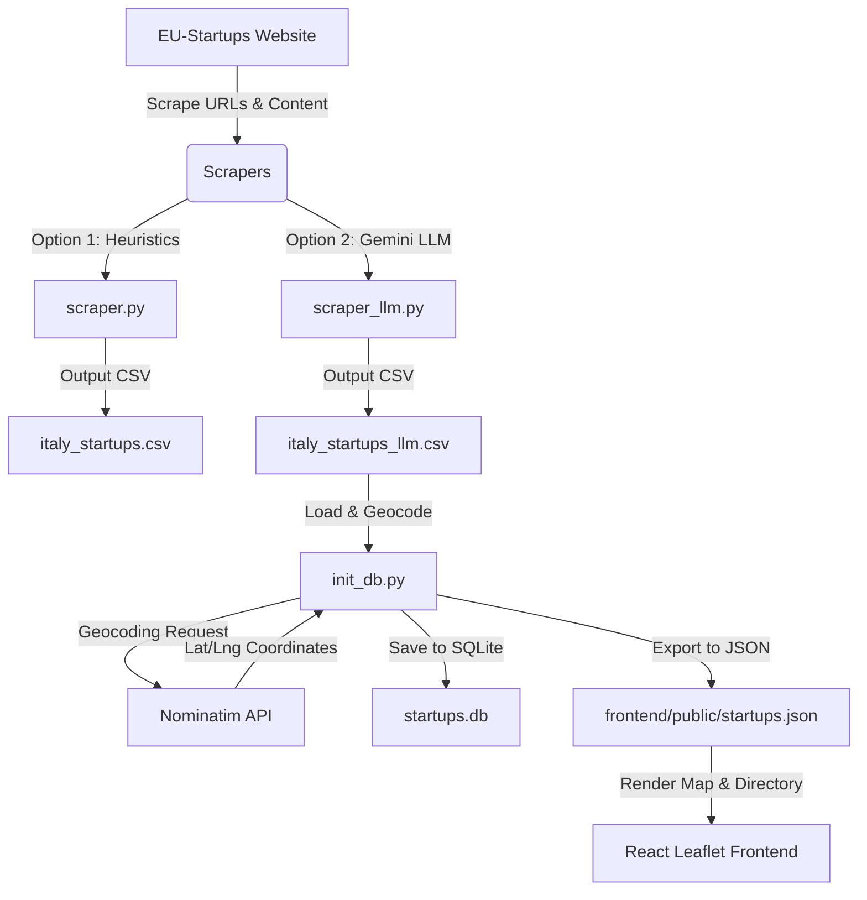

# Italy Startups Project Architecture

This project crawls, parses, geocodes, and visualizes information about Italian startups featured on [EU-Startups](https://www.eu-startups.com/category/italy-startups/).

## Overview

The workflow consists of three main components:
1. **Data Acquisition & Extraction**: Fetching article links and extracting startup details (Name, Location, Founders, Website, Article URL) using either a heuristic approach or an LLM-based approach.
2. **Storage & Geocoding**: Storing the extracted data into an SQLite database (`startups.db`) and geocoding the startup locations into geographical coordinates (Latitude/Longitude) using the Nominatim OpenStreetMap service.
3. **Visualization (Frontend)**: A React application built with Vite and Leaflet maps to visualize the startups interactively.

---

## System Architecture & Data Flow

---

## Detailed Components

### 1. Scrapers
* **Heuristic Scraper ([scraper.py](file:///Users/antonio/code/GIT/italy%20startups/scraper.py))**:
  * Crawls all pages of the "Italy Startups" category on EU-Startups.
  * Uses regular expressions and string matching heuristics to extract name, founders, location, and website.
  * Saves results to `italy_startups.csv`.
* **LLM Scraper ([scraper_llm.py](file:///Users/antonio/code/GIT/italy%20startups/scraper_llm.py))**:
  * Utilizes the `google-genai` SDK and the `gemini-2.5-flash` model.
  * Uses structured outputs (`response_mime_type="application/json"` with a Pydantic schema) to accurately extract fields.
  * Saves results to `italy_startups_llm.csv`.

### 2. Database & Geocoding ([init_db.py](file:///Users/antonio/code/GIT/italy%20startups/init_db.py))
* Reads data from `italy_startups_llm.csv`.
* Geocodes the text location (e.g., "Milan", "Rome") using the Nominatim API (`geopy`).
* Implements a local caching dictionary to minimize API requests and avoid rate limiting.
* Populates an SQLite database table `startups` inside `startups.db`.
* Exports geocoded startups to `frontend/public/startups.json` for the frontend application.

### 3. Frontend Application
* A React/Vite app located in the `frontend/` directory.
* Uses **Leaflet** (`react-leaflet`) to render an interactive map with markers.
* Provides search, listing, and filtering capabilities based on the imported `startups.json`.
